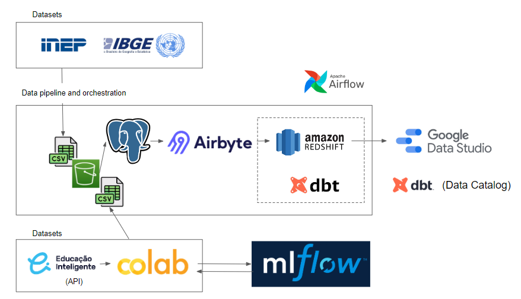

# gdp-vs-national-education-exam-in-brazil
This repository contains the solution for the FIAP - MBA Data Engineering Sprint 5 Challenge, which ultimately aims to answer the following question: "What is the impact of the Gross Domestic Product (GDP) of municipalities on Education, present and future, considering the performance in the National Students Exam (ENEM)?"

## Datasets

Two datasets are used in this project. The original files can be find by accessing the hyperlink shortcuts below:

1. [INEP](https://www.gov.br/inep/pt-br/acesso-a-informacao/dados-abertos/microdados/enem): contains granular data from the ENEM. As each year file can get as large as 2GB, the original files were uploaded directly to a raw S3 bucket used as landing zone. The ETL INEP file cleans the data by removing unnecessary columns, uploads them to a refined zone bucket and copy all the yearly files data to a single table in Postgres.

2. [IBGE](https://www.ibge.gov.br/estatisticas/downloads-estatisticas.html): contains information about the GDP per municipality. Data can be linked to the ENEM files using the municipality code column. A sample of this dataset can be find inside the dataset folder. The ETL IBGE file cleans the data, rename columns and loads it into Postgres.

## Project

How to replicate:

1. Download INEP and IBGE data files and upload IBGE files to a raw S3 bucket. Update the bucket policies so they can be publicly accessed.
2. Run the ETL IBGE and ETL INEP files to clean the data and load them into Postgres tables.