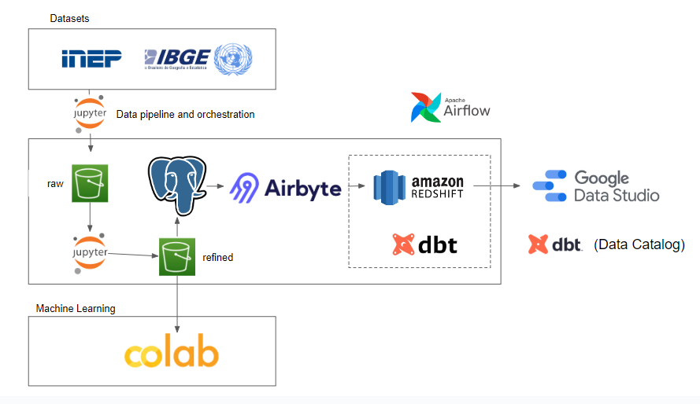

# gdp-vs-national-education-exam-in-brazil
This repository contains the solution for the FIAP - MBA Data Engineering Sprint 5 Challenge, which ultimately aims to answer the following question: "What is the impact of the Gross Domestic Product (GDP) of municipalities on Education, present and future, considering the performance in the National Students Exam (ENEM)?"

## Datasets

Two datasets are used in this project. The original files can be find by accessing the hyperlink shortcuts below and the cleaned files can be found under the dataset folder:

1. [INEP](https://www.gov.br/inep/pt-br/acesso-a-informacao/dados-abertos/microdados/enem): contains granular data from the ENEM. As each year file can get as large as 2GB, the files were manually cleaned to keep only vital information for the proposed analysis and file sizes were reduced to <100MB by removing non essential columns.

2. [IBGE](https://www.ibge.gov.br/estatisticas/downloads-estatisticas.html): contains information about the GDP per municipality. Data can be linked to the ENEM files using the municipality code column (ibge.municipality_id = inep.CO_municipio).

## Project

