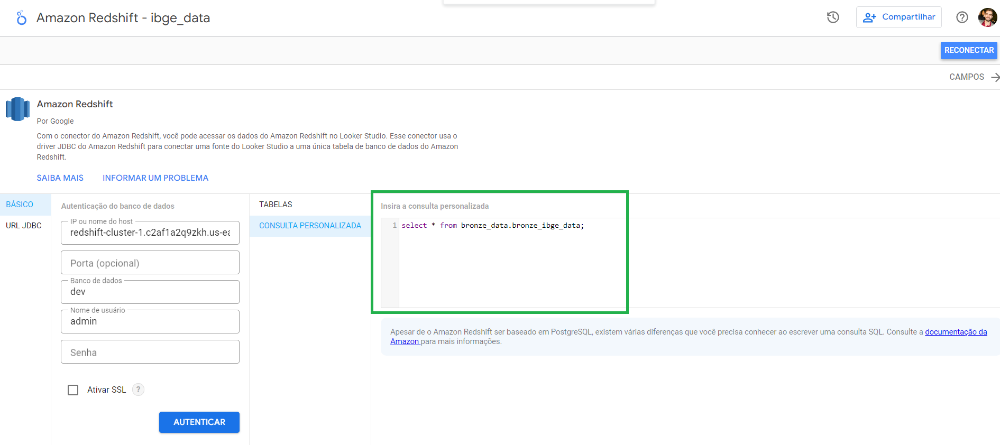

# gdp-vs-national-education-exam-in-brazil
This repository contains the solution for the FIAP - MBA Data Engineering Sprint 5 Challenge, which ultimately aims to answer the following question: "What is the impact of the Gross Domestic Product (GDP) of municipalities on Education, present and future, considering the performance in the National Students Exam (ENEM)?"

## Datasets

Two datasets are used in this project. The original files can be found accessing the hyperlink shortcuts below:

1. [INEP](https://www.gov.br/inep/pt-br/acesso-a-informacao/dados-abertos/microdados/enem): contains granular data from the ENEM. As each year's file can get as large as 2GB, the original files were uploaded directly to a raw S3 bucket used as a landing zone. The ETL INEP file cleans the data by removing unnecessary columns, uploading them to a refined zone bucket, and copying all the yearly file data to a single table in Postgres.

2. [IBGE](https://www.ibge.gov.br/estatisticas/downloads-estatisticas.html): contains information about the GDP per municipality. Data can be linked to the ENEM files using the municipality code column. A sample of this dataset can be found inside the dataset folder. The ETL IBGE file cleans the data, renames columns, and loads it into Postgres.

## Project

How to replicate:

1. Download INEP and IBGE data files and upload IBGE files to a raw S3 bucket. Update the bucket policies so they can be publicly accessed.
2. Run the ETL IBGE and ETL INEP files to clean the data and load them into Postgres tables. IBGE data should be quite fast to upload, but INEP data can take up to two hours depending on your machine OS and internet connection given the larger data size.

3. Airbyte Postgres Redshift #TODO

4. DBT Modelling #TODO

5. Connect Redshift with Google Data Studio - it might be necessary using a SELECT * query for the connection instead of selecing the table via the UI to avoid connection errors as demonsrated in the image below

Some basic explorations were done just to try out GDS as a BI tool and to explore our two datasets. 

**For the IBGE dataset**, we found 61.255 records and overall the information seems to be correct, as charts mostly confirm our already existing knowledge about the country.

The southeast segion, for example, has the highest GDP in Brazil, accounting for more than all of the other regions together.

Similarly, the city of São Paulo itself was responsible for a quarter of the southest region GDP in 2020 and equals the sum of Rio, Brasilia and Belo Horizonte, the 2nd to 4th cities after São Paulo in the ranking.

It is interesting to see, however, a change in the rankings when looking at GDP per capita. The midwest and south of Brazil appears in the 1st and 2nd positions, most likely due to the lower population number at a first glance.

A deeper look at the city level gives us a more insightful vision, given that the top cities in the ranking are linked to strong mining or agricultural activity.

Finally, the most insightful exploration for this dataset is the finding that the south and midwest have been fighting over the highest GDP/capita region in the past decade, with the midwest finally gaining some advantage in the year of 2020. The leading region has an average GDP/capita ratio 3x higher than the northeast, last in the ranking.

**For the INEP dataset**

The first thing that is important to understand about the ENEM data is that the number of subscribed students does not equal the total number of participants. 2020, for example, had the highest number of subscribed students but also the highest abstention rate (>50%).

In a basic exploration inside GDS, it is possible to filter the states and cities with the highest numbers of subscribed students. Comparing the top 10 cities with highest GDP and the one with most subscribed students, we can see that cities from the north and northeast region tend to gain positions in the subscribed students versus big southeast cities such as Guarulhos, Campinas, Osasco and Belo Horizonte.

A curious fact is that the male gender performs better than the female gender in all disciplines, specially math. However, for some reason females perform way better in essays.

Finally, in a preliminary attempt to understand correlation between high GDP/capita and ENEM grades, the following chart with the top 10 essay cities was developed, but none of the highest GDP/capita cities show up in there, which points to a not so high correlation at the beggining.

